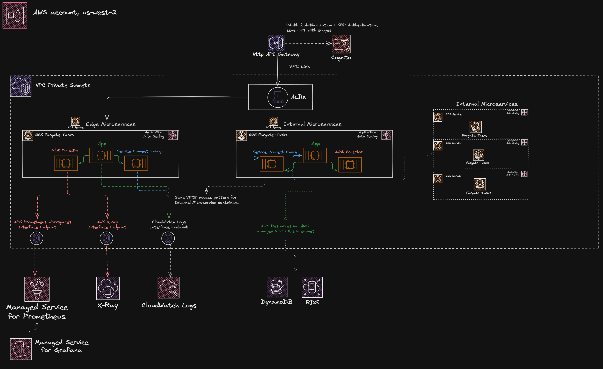

# platform-aws-cdk

IaC CDK project for a fully portable, fully reproducible platform AWS architecture end-to-end. 

For my standardized microservice, first refer to github repo README: 

[platform-service](https://github.com/jaykhan0713/platform-service)

---
## About this project

This CDK project serves as a part of my portfolio to demonstrate my skills 
in developing an entire portable, secure AWS architecture end-to-end for a single account
with clear ownership boundaries of cloudformation stacks. 

Note: To mitigate costs for the portfolio, a single account is used with only "prod" environment in mind. This project is able to be tweaked for single account multi-env (test, prod, etc) as well as
multi account (test, prod, etc). CICD for single account is emulated under a "tools" environment but can also move to multi-account.

The stack boundaries, in order of cdk app deployment on a fresh AWS account are these \<area\>

---
## High level runtime workflow:



Intent: Deploy any edge or internal microservices easily templated from below. Service is fully functional wired
with observability and resiliency end-to-end. Portability of defaults require one line of code in CDK and CICD automates
the rest.
---
## Adding a microservice

1. Template this project: [platform-service](https://github.com/jaykhan0713/platform-service)
2. Rename all occurrences of "service-template" to your new service name ex: "edge-service"
3. On CDK project's platform-service-registry.ts, simply add in a key value pair one-liner into PlatformService object: edgeService: 'edge-service'
4. By default, the service will be in service connect client + server mode, but you can choose to put it behind an ALB
   with only service connect client mode. Simply choose exposure: 'alb'
5. Run: npm run cdk:cicd deploy --require-approval never 'EdgeService*'
   This automates: ECR repo, CodeArtifact for DTOs, published via a dto CodePipeline. CodePipeline for the microservice itself.
6. Once the above dependencies are published, trigger the execution of microservice's CodePipeline via AWS console (i.e edge-service-pipeline) that deploys your service into production.
7. You now have a fully standardized and secure ECS fargate microservice deployed in your vpc private subnet. All it took was a line of CDK code!
8. Start working on your business-layer use cases for the microservice.
9. K6 Load tester with Cognito OAuth2 and Client Credentials in front of an Http API gateway invoked by a lambda, so you can see AWS xray traces, Cloudwatch logs, Grafana light up
   under synthetic traffic.

Note: By default for a portfolio, taskdef is using the cheapest ECS resources (with scaling and health checks in place). 
These mem/cpu resources are overridable and
distributed between your app, adot collector sidecar, and envoy sidecar (handled by ECS Service Connect)

---
## Ownership app boundaries for deploying stacks, Full portability and reproducibility on a fresh AWS account

Refer to [SETUP.md](docs/SETUP.md) to initialize account/profile

To change project name refer to env-config.ts

For every \<area\> below, in order.
```
npm run cdk:<area> -- deploy --require-approval never --all
```

\<area\> in order of deployment
```
network: VPC, VPC endpoints, VPC Link
observability: Grafana, Prometheus workspaces
service-runtime: ECS Cluster, Service Connect Http namespace, ECS shared membership security group
cicd: - ECR repos for service apps, foundation (k6 load testing, adot collector, base-images, etc)
      - CodePipelines for foundations (image push to above ECR repos)
      - CodePipelines for services owned DTO publishing to CodeArtifact
      - CodePipelines for services, source/build/deploy
gateway: Cognito, Http API gateway
```

\<area\> that are handled by Codepipeline and use cdk deploy (sources this project).

```
services: ECS Tasks on ECS Fargate Service behind ALB or service connect server-mode envoy sidecar 
load-test: K6 runner and Lambda that invokes runner with optional params via ops/load-test.sh or AWS UI/cli
```

Note: before executing service CodePipelines, ensure DTO pipelines have successfully passed and published.

---
## Security

Security is handled tightly across the architecture via SG ingress, egress and Cognito Auth at the Gateway.
TLS is terminated at the gateway. ALB listens on HTTP port 80, internal microservices are http.

### VPC Private Subnet with VPC endpoints (No NAT)
All services are deployed on private subnets within the VPC with no egress to internet. Any AWS resources fargate or
containers need are handled via VPC endpoints.

### IAM
IAM roles are tightly scoped to only the ARN resources the role needs access to.

### Security Groups
A security group membership model is used with ECS tasks. The service-runtime stack creates a shared
ECS membership model that is registered to every FargateService (along with a unique task SG). Every FargateService then accepts only ingress
from that security group. This keeps up portability as you can still add a microservice easily. The tradeoff
is this rule technically says any fargate task can talk to any fargate task in the VPC which is not a security issue
but a matter of disciplining outbound calls at the app level. 

For services behind ALB, only their unique SG accepts traffic
from the ALB sg.

VPC Link also uses a membership model. The VPC Link is created with an SG who's egress is tightly scoped to only an additional 
VPC link membership SG. That VPC membership SG is then added to the ingress of any edge ALB's SG. This is more about ownership
boundaries and keeps portability so that new ALB's can be created without VPC link needing to add a new egress every time.
This ensures either way that the only entry points from the API gateway are the desginated ALB's at the edge.

### Http API Gateway with Cognito
Cognito OAuth2 Authorizers are attached to gateway integrations. SRP authentication is used for real users, JWT tokens are issued by 
Cognito. User must pass in bearer token to API gateway in order for Cognito to verify. Gateway then extracts a sub id from the verified token
and propagates to the private subnet internal ALB that as a part of the source of truth for user identity (http header x-user-id)
For users, a cognto managed login web page UserPoolClient is used or can use postman+openid scopes

For Synthetic load traffic, Http Client Credentials UserPoolClient is used (x-user-id is removed upon entry for security).
A custom scope, client id is stored in SSM for the k6 runner to fetch via parameter key. Client Secret ID is stored in AWS Secret manager.

### Security TODOs
WAF is not used due to cost constraints for the portfolio.
public API with tokens and rate-limiting will be created later as unfortunately Http API gateway enforces
it's rate limiting and burst limits on all integrations in a stage ($default being used)

---
### CICD

Sidenote: created dates can be very recent, as every cdk.app and stack in this project is fully portable- I've done experiments where I cdk destroy all stacks
or an entire ownership boundary such as cicd and deploy fresh.

Intent: cicd app handles automatic creation for the following:

## ECR repos for services, sidecars, dependencies such as base-images for jdk and jre. Load testing deps (k6 project)


Note when simply adding a service to the registry, it's ecr repo is automatically created.

## CodePipeline

TODO: Create index for app boundaries


---
## Status

Actively evolving as a platform foundation. MVP complete

---
## Contact

Please feel free to reach out and discuss anything at jaykhan0713@gmail.com

---
