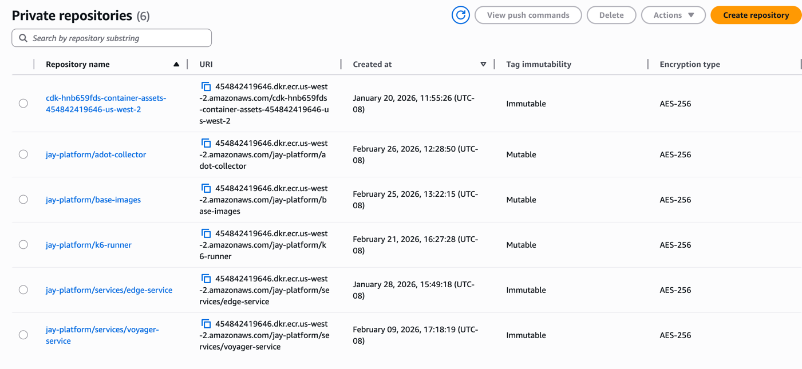
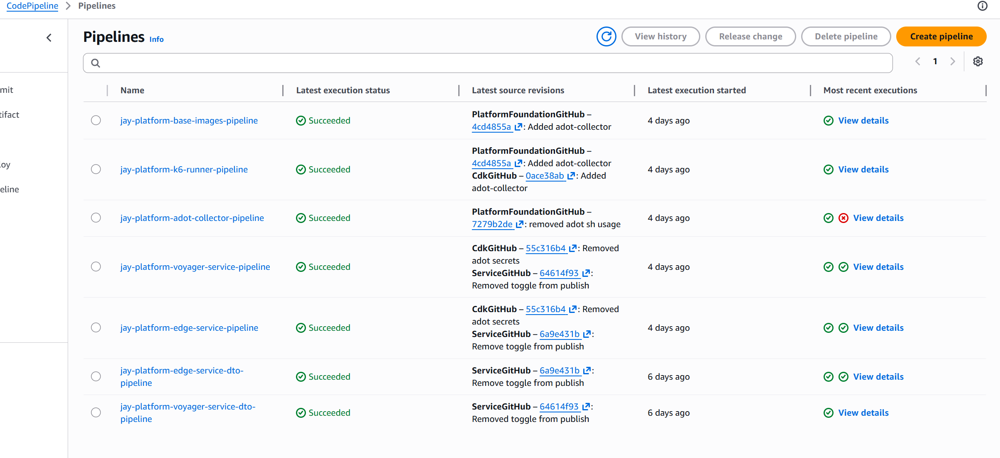

## CICD

Intent: cicd app handles full automatic creation for runtime and it's dependencies.

Sidenote: created dates can be very recent, as every cdk.app and stack in this project is fully portable- I've done experiments where I cdk destroy all stacks
or an entire ownership boundary such as cicd and deploy fresh.

## ECR repos for services, sidecars, dependencies such as base-images for jdk and jre. Load testing deps (k6 project)

Note when simply adding a service to the registry, it's ecr repo is automatically created.

## CodePipeline

The following are automated

- Foundation images with custom code (adot collector, k6 load tester with lambda invoker), base-images (jdk and jre 25)
- Microservice owned DTOs are standardized and published in their own pipeline lifecycle
- Microservices that are added above. Builds both the image containing java entrypoint as well as CDK project to deploy the service stacks automatically with ease

---