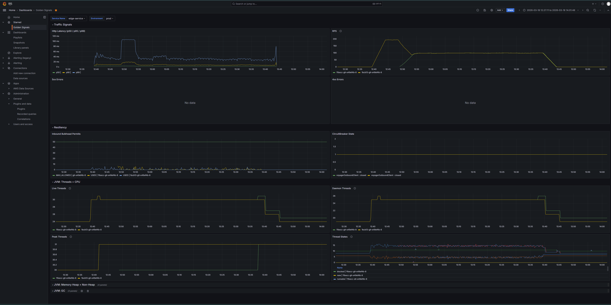
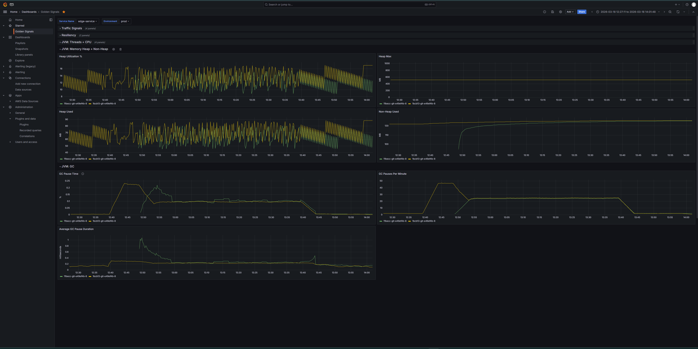
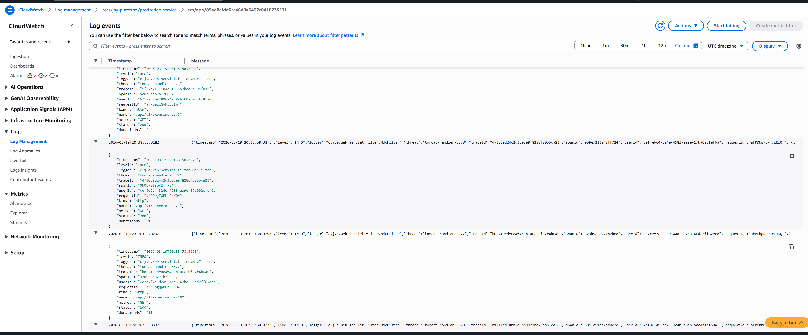
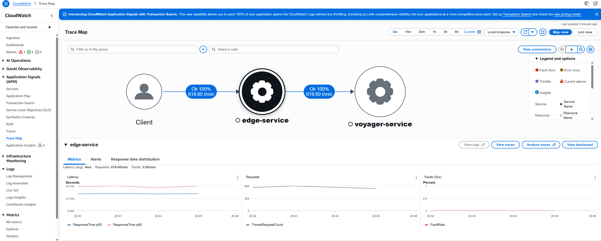
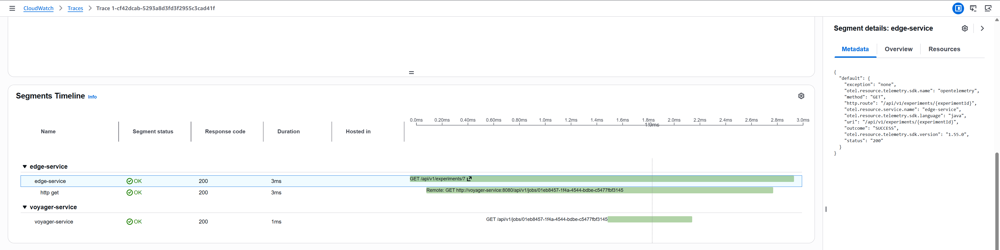
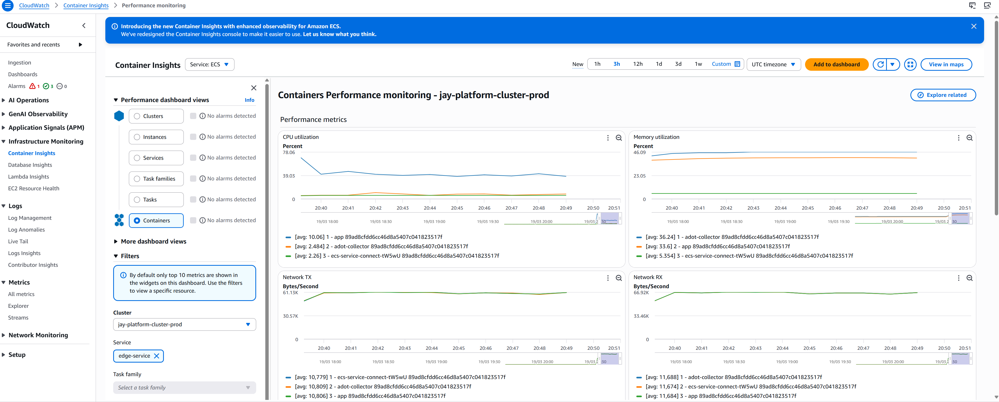

## Observability

- Each microservice ships with a configured adot-collector, Amazon's distribution for OpenTelemetry. This configuration
  has a prometheus scraper that pushes to APS workspace, Otel traces are pushed to AWS x-ray. Retrieves ECS task metadata for APS
- CDK handles both Prometheus (APS) and Grafana workspaces.

---
### Grafana Golden Signals automatically avaialble to each deployed microservice. (p50/P90/P99 latency, Errors, Circuitbreakers, Bulkheads, JVM metrics)

---
### Cloudwatch logs for microservices standardized JSON format for cost effective querying

---
### AWS x-ray (Currently sample at 0.1 at the edge for cost savings on load tests)

---

### ECS Container insights

